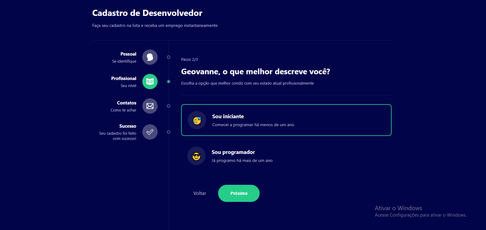
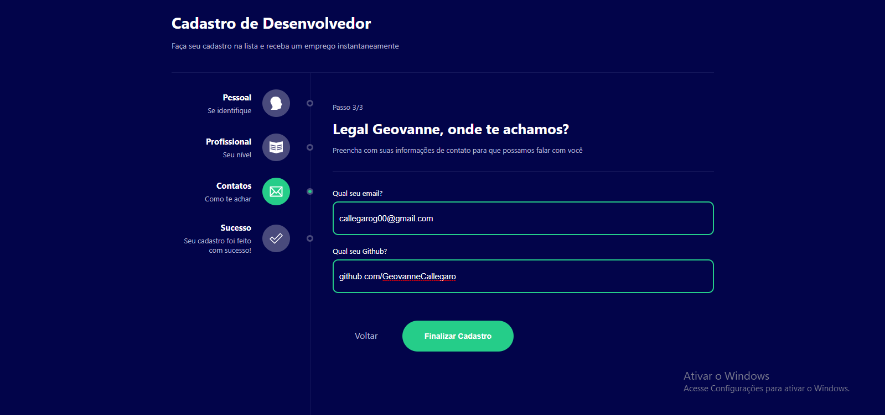
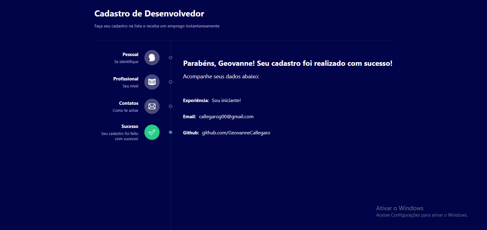
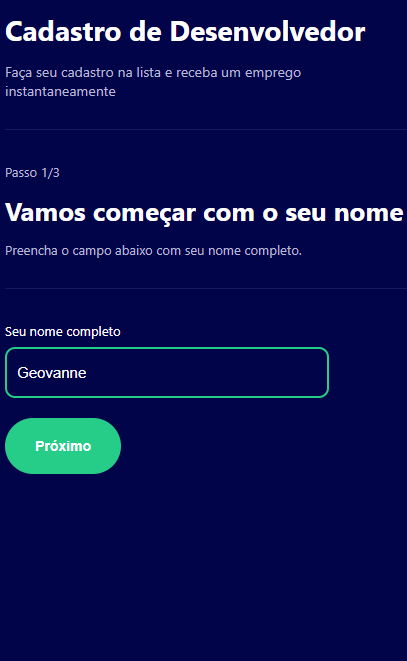
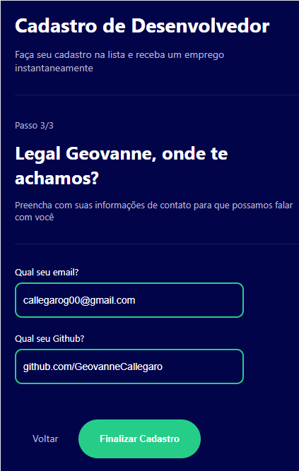

# Multiform React


> Um projeto que simula o funcionamento de um formulário multi etapas, onde o usuário vai preenchendo suas informações como avança.

<p align="center">Acesse o projeto clicando <a href="https://multiform-react-three.vercel.app/"> aqui </a></p>

### Ajustes e melhorias

O projeto encontra-se finalizado! Entretanto, ainda há pontos para sua melhoria:

- [ ] Testar os componentes

## 💻 Pré-requisitos

Antes de começar, verifique se você atendeu aos seguintes requisitos:
<!---Estes são apenas requisitos de exemplo. Adicionar, duplicar ou remover conforme necessário--->
* Você instalou a versão mais recente das linguagens, dependências e bibliotecas requiridas
* Você leu o guia relacionado ao projeto

## 🔧 Tecnologias usadas no projeto:

</img>
</img>
</img>
</img>
</img>

## 🚀 Instalando AutoLuby Project

Para instalar o projeto, siga estas etapas:

Windows:
```
npm install
```

## 🔐Fazer login no projeto (verificar o arquivo de mock)

## ☑ Funcionalidades do projeto

- [x] Registrar seus dados
- [x] Ao final, é capaz verificar tudo que foi preenchido!
- [x] Proteção para que não possa avançar sem preencher as telas

## ✨ Mais imagens do projeto








## 📫 Contribuindo para o projeto
<!---Se o seu README for longo ou se você tiver algum processo ou etapas específicas que deseja que os contribuidores sigam, considere a criação de um arquivo CONTRIBUTING.md separado--->
Para contribuir com o projeto, siga estas etapas:

1. Bifurque este repositório.
2. Crie um branch: `git checkout -b <nome_branch>`.
3. Faça suas alterações e confirme-as: `git commit -m '<mensagem_commit>'`
4. Envie para o branch original: `git push origin <nome_do_projeto> / <local>`
5. Crie a solicitação de pull.

Como alternativa, consulte a documentação do GitHub em [como criar uma solicitação pull](https://help.github.com/en/github/collaborating-with-issues-and-pull-requests/creating-a-pull-request).

## 🤝 Colaboradores

Agradecemos às seguintes pessoas que contribuíram para este projeto:

<table>
  <tr>
    <td align="center">
      <a href="#">
        <br>
        <sub>
          <b>Geovanne Callegaro</b>
        </sub>
      </a>
    </td>
  </tr>
</table>

## 📝 Licença

Esse projeto está sob licença. Veja o arquivo [LICENÇA](LICENSE.md) para mais detalhes.
